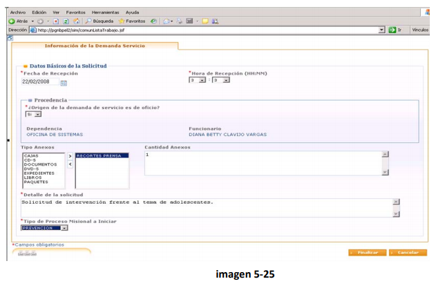

## NAVEGACIÓN EN SIM

El funcionario en ejercicio del cumplimiento de sus funciones de control y seguimiento, puede iniciar de oficio un asunto.

### Ingreso al Aplicativo:

##### • Ingreso a la aplicación: Digitando la dirección [http://sim.procuraduria.gov.co](http://sim.procuraduria.gov.co![]%28/assets/import08.png)

##### 

En la pantalla Inicio de Sesión digitar su Usuario y su clave, los cuales corresponderán a los mismos con los cuales ingresa a su equipo en la PGN:

##### • Interfaz gráfica:

La Interfaz gráfica del SIM  está compuesta por dos áreas básicas:  El cabezote que contiene información que permanecerá visible durante toda la navegación que el Funcionario realice, y el área de trabajo, en la que el usuario registra la información pertinente con cada etapa secuencial del proceso.

##### 

#### • Iconos del cabezote:

|  ICONOS    | DESCRIPCION     |
| ---- | ---- |
|  	| **Iconos de acceso directo:** Permiten el acceso a las acciones que el Usuario realiza con más frecuencia. Se definen de acuerdo con el perfil del Usuario, es decir sus accesos y permisos en el sistema. |
|  | **Menú:** El Funcionario podrá acceder a diferentes opciones según su perfil.  Permite acceder a la lista de tareas a realizar. |
|  	|  **Nombre de Usuario, Fecha y hora.** |
|	 	|	**Salir:** Permite al Usuario abandonar la sesión |

##### • Lista de trabajo:

Presenta los casos que están asignados al Funcionario. Sus componentes son:

• Columnas básicas de la lista de trabajo:

1. Prioridad: indica con una bandera de un color determinado el grado de importancia que tiene la solicitud o el Caso, así: bandera verde: baja, bandera amarilla: media y bandera roja: alta.
2. Descripción de la solicitud: Indica brevemente el asunto o materia sobre la cual versa la petición de servicio
3. IUS: es el Identificador Único de Solicitud el cual corresponde al número de radicación en el Sistema SIAF. 
4. IUC: es el Identificador Único del Caso, asignado por el SIM automáticamente cuando el funcionario decide Abrir el Caso.
5. Proceso: este dato indica principalmente el área misional a la cual corresponde el caso: Preventivo, Intervención o Disciplinario. 
6. Actividad: se refiere a cada una de las actividades que conforman el proceso misional.
7. Estado actual: indica el estado de la actividad
8. Fecha Asignación: relaciona la fecha en que se inició la actividad
9. Control de Términos: Informa los vencimientos de los Casos asignados
10. Búsqueda Avanzada de Tareas: Permite establecer criterios de búsqueda por Proceso, Actividad, Fecha Inicial, Fecha Final, IUS \(Identificador Único de Solicitud\) o IUC \(Identificador Único de Caso\). 

* **Formularios: **Es la plantilla que usted ve al dar click o iniciar cada una de las actividades en la lista de trabajo

* Para ingresar a cada opción del formulario, el usuario debe hacer clic en la pestaña correspondiente:

* Campos más relevantes en los formularios:

     |  ICONOS    | DESCRIPCION     |
     | ---- | ---- |
     |	1	| Título: Nombre de la tarea escogida de la lista de trabajo.|
     |	2	| Subtítulos: El usuario puede ver la información contenida en los formularios agrupada por temas específicos detallados en los diferentes subtítulos; estos están identificados con un cuadro Azul previo al nombre del subtítulo.|
     |	3	| Campos de Texto: En algunos casos el usuario encontrará espacios en donde debe diligenciar el campo con la información correspondiente.|
     |	4	| Áreas de texto: En estos campos el usuario debe ingresar información relacionada con motivaciones, razones o anexos a las decisiones tomadas en las diferentes actividades.|
     |	5	| Listas desplegables: El Usuario podrá seleccionar de la lista la opción predefinida que escoja.|
     |	6	| Campo agregar información: En este campo el usuario debe seleccionar la opción adecuada y agregarla con el icono &gt;, si desea eliminar una selección debe hacer clic en el icono &lt;.|
     |	7	| Casilla de Verificación: Se utilizan para seleccionar una sola opción. Para activarla debe hacer click dentro de la casilla de verificación.|
     |	8	| Campos obligatorios: Son aquellos campos que siempre deben diligenciarse, son imprescindibles. Se identifican porque tienen un asterisco en rojo.|
     |	9	| Barra de Herramientas: Esta barra está presente cuando el usuario necesita aplicar algún instrumento o función determinada dentro del área de trabajo en una Actividad.,Para desplegar esta opción el usuario debe hacer clic en el icono ubicado en la parte superior del formulario, para minimizar y generar más espacio en el área de trabajo el usuario debe hacer clic en el ícono . Lo primero que el funcionario encontrará serán los instrumentos agrupados en categorías según el área misional. En una zona especial el usuario podrá tener funciones determinadas, estas se mostrarán a través de íconos y de la barra denominada Funciones.|

• Botones:
|  ICONOS    | DESCRIPCION     |
| ---- | ---- |
|    1   | Ubica al usuario en la pantalla Lista de Trabajo donde se listan las tareas. |
|     2  | Se utiliza para finalizar las actividades de los procesos misionales|
|     3  | Lleva al usuario fuera de la actividad que estaba realizando y lo ubica en la pantalla Lista de Trabajo |
|    4   | Almacena temporalmente la información ingresada en los campos de cada una de las actividades |
|  5     | Al hacer clic en este botón dependiendo del criterio de búsqueda, muestra la información requerida de personas, funcionarios, autoridades, etc.|
|    6   | Permite adicionar al formulario de manera permanente la información digitada en un área de texto. |
|     7  | Se presiona para revisar si existe un asunto en trámite asociado con los datos básicos de la solicitud. |
|      8 | Al hacer clic en este botón el usuario genera documento.|
|     9  | Se utiliza para guardar el documento en el sistema.|
|     10  | Se utiliza cuando se desea crear o adicionar un nuevo documento |

• Iconos:

|  ICONOS    | DESCRIPCION     |
| ---- | ---- |
|    1   | Buscar: Al hacer clic en este icono, el sistema ubica donde corresponda el dato proporcionado.|
| 2      | Agregar: Permite que el usuario pueda agregar datos al formulario. |
|    4   | Editar: Haciendo clic en este botón, el usuario podrá modificar determinada información según el Caso. |
|     5  | Imprimir: Al hacer clic en este botón, se imprime el formulario que el usuario haya elegido como soporte al procedimiento realizado en el aplicativo. |
|      6 | Eliminar: Permite al usuario eliminar datos del formulario. |
|       7| Ver u Ocultar: Permite al usuario ver u ocultar los datos básicos de las actividades. |
|     8  | Ayuda en Línea: Permite al usuario ver la ayuda de cada formulario. |
|      9 | Generar Documento: Al hacer clic en este icono el usuario genera el documento en formato PDF.|
|      10 | Prioridad: Permite establecer la cercanía o lejanía de los términos de vencimiento de un caso o solicitud y se representa a través de banderas, La Prioridad puede ser Alta \(color rojo\), Media \(color amarillo\) o Baja \(color verde\). |
|     11  | Calendario: Permite introducir la fecha de alguna actividad. |

** • Búsquedas Avanzada de Tareas:**

Esta funcionalidad dentro del sistema de información le permite al usuario poder ubicar de manera rápida elementos de identificación tales como: Criterio de búsqueda, persona relacionada, Entidad relacionada, lista de resultados.  Y por ultimo hacer clic en el botón Buscar.   Obtenido de manera pronta una respuesta a la solicitud expresada en la búsqueda requerida.

*  **Búsquedas de Personas**

Dentro del sistema del sistema de información tiene como gran utilidad el hecho de poder acceder de manera rápida y precisa a la búsqueda de personas relacionas con procesos dentro del sistema.    Usando criterios de búsqueda definidos como tipo de persona, tipo de identificación, número de identificación, nombres apellidos, y hasta un alias podría llegar a estar relacionado con esta búsqueda.

**Búsquedas Entidades:**

Las bases de datos siempre se encuentran relacionadas con nombres propios, nombres de empresas o entes jurídicos. Nuestro sistema de información cuenta con una apropiada base de datos de las entidades del país donde podremos estar relacionando de manera rápida dentro del ingreso de procesos.

**Radicar demanda de Servicio SIM:**

Esta funcionalidad dentro del sistema de información le permite al funcionario actual de oficio antes situaciones que sean de competencia del ministerio público.  Es decir que no tiene que mediar una queja anterior que motive el inicio misional donde actúe el ministerio público.  En estas ilustraciones se inicia el proceso misional, y se inicia por un recorte de prensa.

